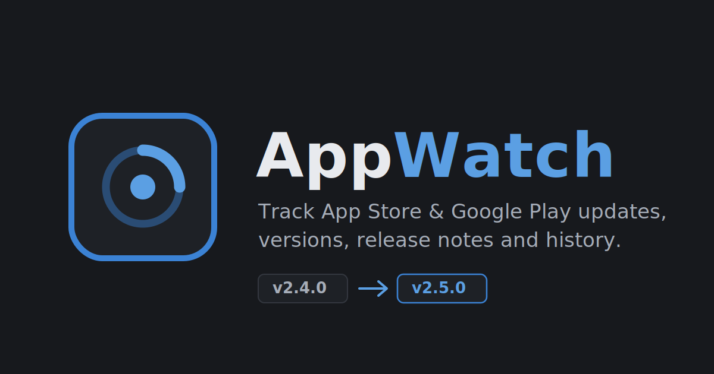
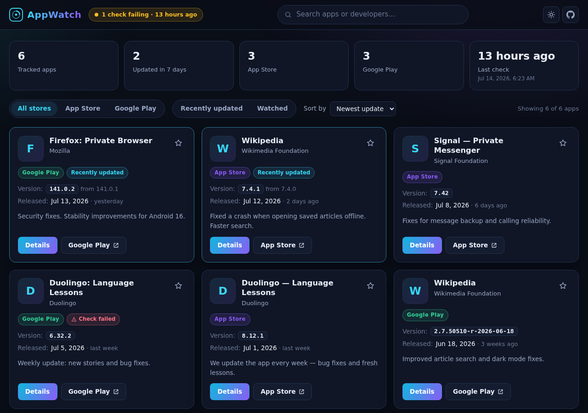
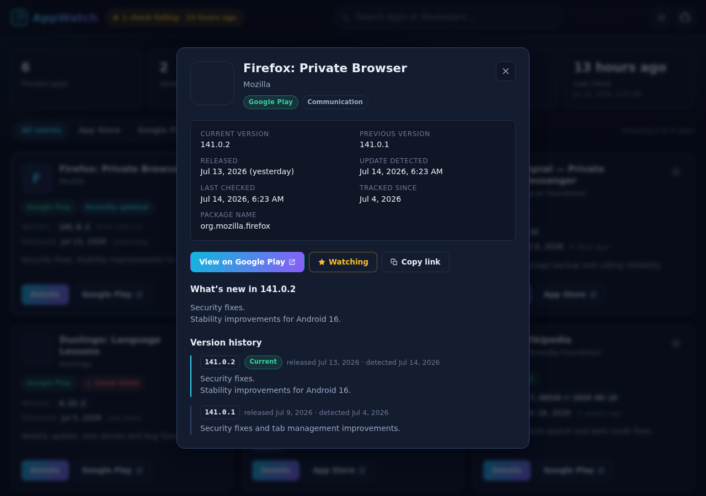
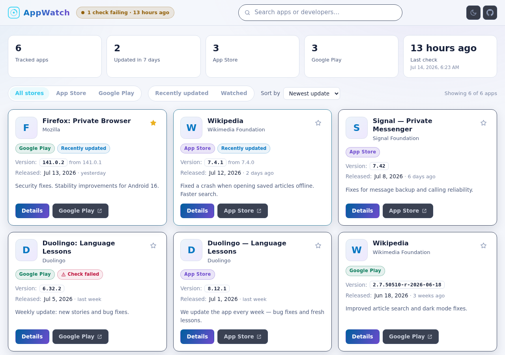

<p align="center">
  
</p>

<h1 align="center">AppWatch</h1>

<p align="center">
  A modern dashboard that tracks <strong>App Store</strong> and <strong>Google Play</strong> app updates —
  versions, release notes, release dates and full version history.
</p>

<p align="center">
  <a href="https://dawsoncodes.github.io/AppWatch/"><strong>➜ Live site</strong></a>
  ·
  <a href="https://github.com/DawsonCodes/AppWatch/issues/new/choose">Report an issue</a>
  ·
  <a href="#adding-and-removing-tracked-apps">Add an app</a>
</p>

<p align="center">
  
</p>

---

## Preview

|                      Dashboard (dark)                      |                     App detail                      |
| :--------------------------------------------------------: | :-------------------------------------------------: |
|  |  |

<details>
<summary>Light theme</summary>



</details>

> Screenshots show example data; the live site reflects whatever the checker
> most recently collected.

---

## What it does

AppWatch checks the App Store and Google Play a few times a day and records
what changed. For every tracked app it shows:

- Name, icon, developer and category
- Platform (App Store / Google Play) with a direct store link
- Current version and the previous version it replaced
- Release date and how long ago that was
- The full "What's New" release notes, rendered safely as plain text
- Complete stored version history with detection timestamps
- Whether an update was detected recently, and when the last check ran
- Per-app check failures, without breaking the rest of the dashboard

Visitors can search, filter by store or recency, sort, and keep a personal
**watchlist** — stored only in their own browser.

## How it works

```
apps.config.json          (human-edited: which apps to track)
        │
        ▼
GitHub Actions (every 6 h) ──►  scripts/check-updates.ts
        │                        ├─ Apple provider  → iTunes Lookup API
        │                        └─ Google provider → google-play-scraper
        ▼
public/data/*.json        (generated, version-controlled)
  apps.json    normalized app records
  history.json version history per app
  status.json  checker run summary
        │
        ▼
GitHub Pages              (static Vite + Preact frontend reads the JSON)
```

There is **no server, no database, no accounts and no API keys**. The data
lives in git, the checker runs on a schedule in GitHub Actions, and the site is
plain static hosting. A checker run only commits (and redeploys) when something
meaningful changed — timestamp-only churn is ignored.

### Update detection & version history

When the checker sees a version different from the stored one it:

1. moves the old version to `previousVersion`,
2. records the new version, its release date and the release notes available at
   detection time,
3. prepends a history entry (duplicates by version are rejected),
4. stamps `lastUpdatedAt` so the UI can badge the app as recently updated.

History is never fabricated: each app's history starts from the first
successful snapshot and grows as real updates are detected. Failed checks keep
the last good data and surface a per-app error instead.

## Tech stack

| Layer       | Choice                                                                                                      |
| ----------- | ----------------------------------------------------------------------------------------------------------- |
| Frontend    | [Vite](https://vite.dev) + [Preact](https://preactjs.com) + TypeScript, hand-written CSS                    |
| Checker     | Node.js 22 + [tsx](https://tsx.is), no framework                                                            |
| Apple data  | iTunes Lookup API (public, keyless)                                                                         |
| Google data | [google-play-scraper](https://github.com/facundoolano/google-play-scraper), isolated in one provider module |
| Tests       | [Vitest](https://vitest.dev) with fully mocked store responses                                              |
| CI/CD       | GitHub Actions → GitHub Pages                                                                               |

## Local development

Requires Node.js ≥ 20 (see `.nvmrc`).

```bash
git clone https://github.com/DawsonCodes/AppWatch.git
cd AppWatch
npm ci
npm run dev          # dev server at http://localhost:5173/AppWatch/
```

### Commands

| Command                 | Purpose                                               |
| ----------------------- | ----------------------------------------------------- |
| `npm run dev`           | Dev server with hot reload                            |
| `npm run build`         | Production build into `dist/`                         |
| `npm run preview`       | Serve the production build locally                    |
| `npm test`              | Run the test suite (no network access needed)         |
| `npm run lint`          | ESLint                                                |
| `npm run typecheck`     | TypeScript                                            |
| `npm run format`        | Prettier write / `format:check` to verify             |
| `npm run check:updates` | Run the real store checker locally (network required) |
| `npm run validate:data` | Validate `public/data/*.json`                         |
| `npm run verify`        | The full CI gauntlet in one command                   |

## Adding and removing tracked apps

Edit **`apps.config.json`**. Every entry in the `apps` array is either a store
URL or a small object — paste whichever you have:

```jsonc
{
  "country": "us", // default App Store storefront / Play country
  "language": "en", // language for Google Play metadata
  "apps": [
    // App Store URL (numeric ID is extracted automatically)
    "https://apps.apple.com/us/app/wikipedia/id324715238",

    // Google Play URL (package name is extracted automatically)
    "https://play.google.com/store/apps/details?id=org.wikipedia",

    // …or explicit objects:
    { "platform": "apple", "id": "570060128" },
    { "platform": "google", "id": "com.duolingo" },
  ],
}
```

Removing an entry removes the app (and its stored history) from the dashboard
on the next check. Duplicates are ignored automatically. After changing the
config you can wait for the next scheduled run or trigger **Actions → Check app
updates → Run workflow**.

## Data files

The checker writes these files into `public/data/` (do not edit by hand):

- **`apps.json`** — one normalized record per app (`id`, `platform`, `storeId`,
  `name`, `developer`, `iconUrl`, `storeUrl`, `currentVersion`,
  `previousVersion`, `releaseDate`, `releaseNotes`, `category`, `bundleId`,
  `firstTrackedAt`, `lastCheckedAt`, `lastUpdatedAt`, `checkStatus`,
  `checkError`, `updateDetected`). Fields a store doesn't provide are `null`,
  never faked.
- **`history.json`** — version history per app id, newest first; one entry per
  version with release date, notes and the detection timestamp.
- **`status.json`** — last run time, success/failure counts, updates detected.

## Deployment (GitHub Pages)

The site deploys automatically; one-time repository setup:

1. **Settings → Pages → Build and deployment → Source: GitHub Actions.**
2. **Settings → Actions → General → Workflow permissions: Read and write
   permissions** (the checker commits data with the built-in `GITHUB_TOKEN`;
   no personal tokens or secrets are used).

Workflows:

- **`deploy.yml`** — builds, validates and deploys on every push to `main`
  (also manually via _Run workflow_). The Vite `base` is `/AppWatch/`, so the
  site works correctly at `https://dawsoncodes.github.io/AppWatch/`.
- **`check-updates.yml`** — runs every 6 hours and on demand; commits
  `chore(data): update tracked app metadata` only when data actually changed,
  then triggers a deployment. Commits made with `GITHUB_TOKEN` cannot re-trigger
  workflows, so the checker → deploy chain is loop-safe by construction.

## Known limitations

- **Google Play metadata is scraped.** Google offers no public metadata API,
  so the Play provider parses the public store pages via `google-play-scraper`.
  Google changes that page structure occasionally; when it breaks, affected
  apps show a "check failed" badge with their last good data until the provider
  (an isolated module: `scripts/lib/providers/googleplay.ts`) or the upstream
  package is updated. Some Play listings also report no concrete version
  ("Varies with device") — AppWatch stores `null` rather than a fake version.
- **Release notes reflect detection time.** Stores overwrite notes in place;
  history entries keep the notes as they were when each version was first seen.
- **Check freshness is bounded by commits.** The dashboard's "last check" time
  updates only when a run produced changes worth committing (by design, to keep
  the git history meaningful).
- **Apple storefront matters.** Version metadata can differ per country; the
  configured storefront (default `us`) is what gets tracked.

## Troubleshooting

| Symptom                                        | Likely cause / fix                                                                                                   |
| ---------------------------------------------- | -------------------------------------------------------------------------------------------------------------------- |
| Site loads but shows "No app data yet"         | The checker hasn't run since setup — run **Actions → Check app updates** manually.                                   |
| Checker fails with "Every check failed"        | Runner couldn't reach the stores (outage or rate limiting) — rerun later; nothing was overwritten.                   |
| One app shows "Check failed"                   | Usually a temporary store error, a removed listing, or a Play page-format change. The card keeps the last good data. |
| Deploy succeeds but assets 404                 | The site must be served from `/AppWatch/` — don't change `base` in `vite.config.ts` unless the repo name changes.    |
| `npm run check:updates` locally returns errors | Some networks/proxies block store endpoints; the GitHub Actions runner is the reference environment.                 |

## Privacy

AppWatch collects nothing. No analytics, no cookies, no fingerprinting, no ads.
The personal watchlist is kept in your browser's localStorage and never leaves
your device. The site talks only to its own origin (data JSON) and loads app
icons from the stores' CDNs.

## Contributing

See [CONTRIBUTING.md](CONTRIBUTING.md). Bug reports, feature ideas and
app-tracking suggestions are all welcome — this project follows the
[Contributor Covenant](CODE_OF_CONDUCT.md).

## License

[MIT](LICENSE) — Copyright © 2026 DawsonCodes
