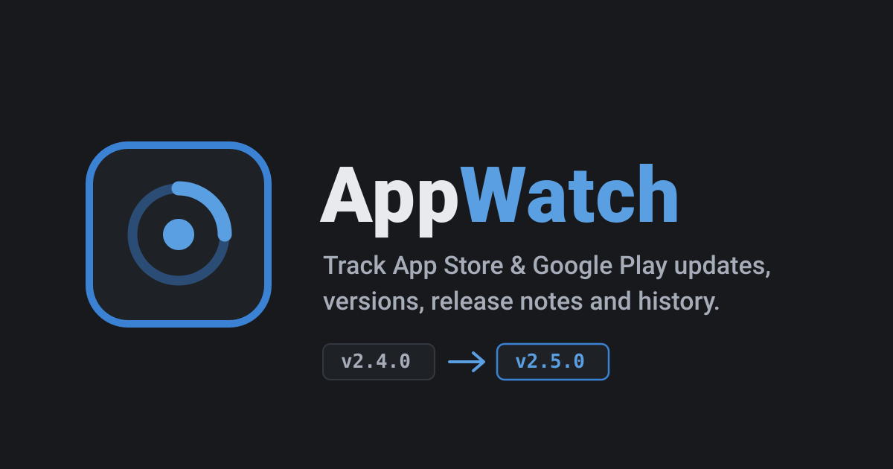
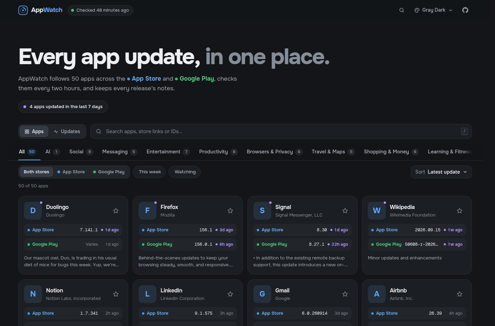
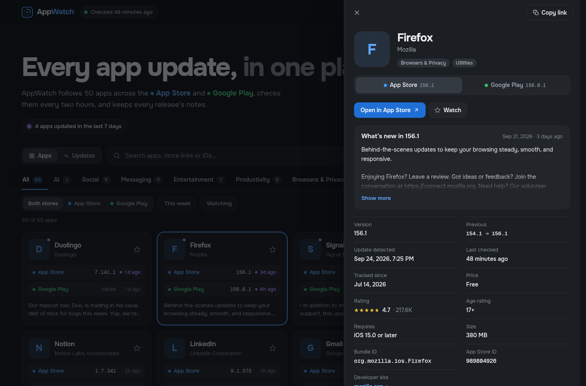
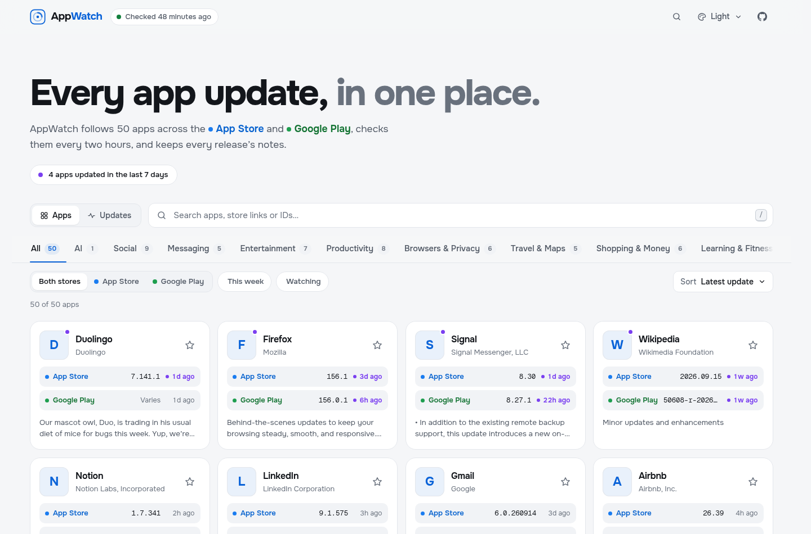
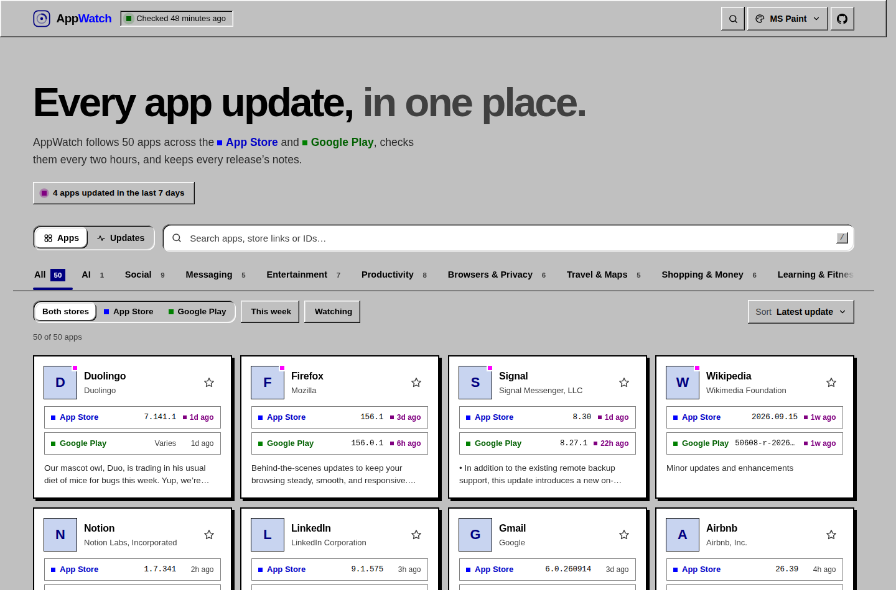

<p align="center">
  
</p>

<h1 align="center">AppWatch</h1>

<p align="center">
  A modern dashboard that tracks <strong>App Store</strong> and <strong>Google Play</strong> app updates —
  versions, release notes, release dates and full version history.
</p>

<p align="center">
  <a href="https://dawsoncodes.github.io/AppWatch/"><strong>➜ Live site</strong></a>
  ·
  <a href="https://github.com/DawsonCodes/AppWatch/issues/new/choose">Report an issue</a>
  ·
  <a href="#adding-and-removing-tracked-apps">Add an app</a>
</p>

<p align="center">
  
</p>

---

## Preview

|                       Gray Dark (default)                       |                     App detail                     |
| :-------------------------------------------------------------: | :------------------------------------------------: |
|  |  |

<details>
<summary>Light and MS Paint themes</summary>





</details>

> Screenshots show example data; the live site reflects whatever the checker
> most recently collected.

---

## What it does

AppWatch tracks 50 App Store and 50 Google Play apps out of the box, checks
every one of them **every two hours**, and records what changed. For every tracked app it shows:

- Name, icon, developer and category
- Platform (App Store / Google Play) with a direct store link
- Current version and the previous version it replaced
- Release date and how long ago that was
- The full "What's New" release notes, rendered safely as plain text
- Complete stored version history with detection timestamps
- Price, user rating, content rating, minimum OS requirement, download size
  and developer website, where the store exposes them
- Whether an update was detected recently, and when the last check ran
- Per-app check failures, without breaking the rest of the dashboard

Visitors can search (by name, developer, store URL, Apple ID or package name),
filter, sort, discover apps beyond the built-in list, and keep a personal
**watchlist** — stored only in their own browser.

## Themes

Three complete themes, selectable from the header:

- **Gray Dark** — the default dark theme: neutral charcoal, restrained blue
  accent, no glow.
- **Light** — clean off-white surfaces with the same blue accent family.
- **MS Paint** — a playful tribute to classic desktop paint software: raised
  and inset bevels, silver window chrome, a navy title bar in the detail view
  and a color-palette strip in the footer. It uses no Microsoft trademarks,
  logos or proprietary assets, and it stays fully readable and accessible.

Your choice is saved in the browser (`localStorage`). On a first visit the
operating-system light/dark preference picks Gray Dark or Light; MS Paint is
only ever active because you chose it.

## Store-wide discovery & your local watchlist

The dashboard is not limited to the repository-configured apps — but honesty
matters about how far that goes:

- **Repository-tracked apps** (from `apps.config.json`) are checked every two
  hours by GitHub Actions for everyone, with stored version history.
- **App Store discovery** works live in your browser: paste an App Store URL
  or numeric ID, or press Enter on a name search, and AppWatch queries Apple's
  public keyless lookup/search API — one request per action, no key, no proxy.
  Some networks/regions don't send the CORS headers this needs; when that
  happens AppWatch says so and offers external store-search links instead.
- **Google Play has no browser-readable metadata API.** Play URLs and package
  names are recognized and can be added with a store link, but their metadata
  cannot be fetched client-side, and AppWatch does not fake it or route it
  through some third-party proxy.
- Apps you add this way become **local watches**: they live only in your
  browser's localStorage, are labeled "Local" everywhere, are _not_ checked by
  the scheduled pipeline, and never sync anywhere. The detail view offers a
  copyable `apps.config.json` line and a link to the tracking-request issue
  form if you want an app promoted to real repository tracking (nothing is
  ever submitted automatically).

## Data freshness (is it real time?)

No — and AppWatch won't pretend otherwise. Neither store pushes update events
to third parties, and a GitHub Pages site has no server to poll continuously,
so "instant" universal detection is not honestly possible with this
architecture. What AppWatch does instead:

- The checker runs every two hours (see the schedule below) and redeploys the
  site after every run, so the published "last checked" time is always real.
- While the page is open, it revalidates the site's **own** tiny
  `status.json` every 5 minutes and whenever the tab regains focus (visible
  tabs only). When a newer run has been deployed, the new data is applied in
  place automatically — no page reload, filters and open panels are kept.
- Every data request revalidates with the server (`cache: no-cache`), so
  GitHub Pages' 10-minute HTTP cache can never hide a fresh deploy.
- Your browser never queries the App Store or Google Play for tracked data;
  only the explicit discovery search above contacts Apple's public API.

## How it works

```
apps.config.json          (human-edited: which apps to track)
        │
        ▼
GitHub Actions (every 2 h)   ─►  scripts/check-updates.ts
        │                        ├─ Apple provider  → iTunes Lookup API (batched)
        │                        └─ Google provider → google-play-scraper
        ▼
public/data/*.json        (generated, version-controlled)
  apps.json    normalized app records
  history.json version history per app
  status.json  checker run summary
        │
        ▼
GitHub Pages              (static Vite + Preact frontend reads the JSON)
```

There is **no server, no database, no accounts and no API keys**. The data
lives in git, the checker runs on a schedule in GitHub Actions, and the site is
plain static hosting. A checker run only commits (and redeploys) when something
meaningful changed — timestamp-only churn is ignored.

### Update detection & version history

When the checker sees a version different from the stored one it:

1. moves the old version to `previousVersion`,
2. records the new version, its release date and the release notes available at
   detection time,
3. prepends a history entry (duplicates by version are rejected),
4. stamps `lastUpdatedAt` so the UI can badge the app as recently updated.

History is never fabricated: each app's history starts from the first
successful snapshot and grows as real updates are detected. Failed checks keep
the last good data and surface a per-app error instead.

## Tech stack

| Layer       | Choice                                                                                                      |
| ----------- | ----------------------------------------------------------------------------------------------------------- |
| Frontend    | [Vite](https://vite.dev) + [Preact](https://preactjs.com) + TypeScript, hand-written CSS                    |
| Checker     | Node.js 22 + [tsx](https://tsx.is), no framework                                                            |
| Apple data  | iTunes Lookup API (public, keyless)                                                                         |
| Google data | [google-play-scraper](https://github.com/facundoolano/google-play-scraper), isolated in one provider module |
| Tests       | [Vitest](https://vitest.dev) with fully mocked store responses                                              |
| CI/CD       | GitHub Actions → GitHub Pages                                                                               |

## Local development

Requires Node.js ≥ 20 (see `.nvmrc`).

```bash
git clone https://github.com/DawsonCodes/AppWatch.git
cd AppWatch
npm ci
npm run dev          # dev server at http://localhost:5173/AppWatch/
```

### Commands

| Command                 | Purpose                                               |
| ----------------------- | ----------------------------------------------------- |
| `npm run dev`           | Dev server with hot reload                            |
| `npm run build`         | Production build into `dist/`                         |
| `npm run preview`       | Serve the production build locally                    |
| `npm test`              | Run the test suite (no network access needed)         |
| `npm run lint`          | ESLint                                                |
| `npm run typecheck`     | TypeScript                                            |
| `npm run format`        | Prettier write / `format:check` to verify             |
| `npm run check:updates` | Run the real store checker locally (network required) |
| `npm run validate:data` | Validate `public/data/*.json`                         |
| `npm run verify`        | The full CI gauntlet in one command                   |

## Adding and removing tracked apps

Edit **`apps.config.json`**. Every entry in the `apps` array is either a store
URL or a small object — paste whichever you have:

```jsonc
{
  "country": "us", // default App Store storefront / Play country
  "language": "en", // language for Google Play metadata
  "apps": [
    // App Store URL (numeric ID is extracted automatically)
    "https://apps.apple.com/us/app/wikipedia/id324715238",

    // Google Play URL (package name is extracted automatically)
    "https://play.google.com/store/apps/details?id=org.wikipedia",

    // …or explicit objects:
    { "platform": "apple", "id": "570060128" },
    { "platform": "google", "id": "com.duolingo" },
  ],
}
```

Removing an entry removes the app (and its stored history) from the dashboard
on the next check. Duplicates are ignored automatically. After changing the
config you can wait for the next scheduled run or trigger **Actions → Check app
updates → Run workflow**.

## Data files

The checker writes these files into `public/data/` (do not edit by hand):

- **`apps.json`** — one normalized record per app (`id`, `platform`, `storeId`,
  `name`, `developer`, `iconUrl`, `storeUrl`, `currentVersion`,
  `previousVersion`, `releaseDate`, `releaseNotes`, `category`, `bundleId`,
  `firstTrackedAt`, `lastCheckedAt`, `lastUpdatedAt`, `checkStatus`,
  `checkError`, `updateDetected`, plus extended metadata where the store
  exposes it: `price`, `contentRating`, `requiresOs`, `sizeBytes`, `rating`,
  `ratingCount`, `developerWebsite`). Fields a store doesn't provide are
  `null`, never faked, and files generated before these fields existed remain
  valid — the extended fields are optional in the schema.
- **`history.json`** — version history per app id, newest first; one entry per
  version with release date, notes and the detection timestamp.
- **`status.json`** — last run time, success/failure counts, updates detected.
  Rewritten on every run and deployed straight to the site; it is only
  committed alongside real app changes, so the git history stays meaningful.

## Deployment (GitHub Pages)

The site deploys automatically; one-time repository setup:

1. **Settings → Pages → Build and deployment → Source: GitHub Actions.**
2. **Settings → Actions → General → Workflow permissions: Read and write
   permissions** (the checker commits data with the built-in `GITHUB_TOKEN`;
   no personal tokens or secrets are used).

Workflows:

- **`deploy.yml`** — builds, validates and deploys on every push to `main`
  (also manually via _Run workflow_). The Vite `base` is `/AppWatch/`, so the
  site works correctly at `https://dawsoncodes.github.io/AppWatch/`.
- **`check-updates.yml`** — runs every two hours and on demand; commits
  `chore(data): update tracked app metadata` only when app data actually
  changed, then deploys the site after every successful run (handing the
  freshly generated data, including `status.json`, to the deploy job as an
  artifact). Commits made with `GITHUB_TOKEN` cannot re-trigger workflows, so
  the checker → deploy chain is loop-safe by construction.

### Check schedule

The checker runs **every two hours** (`17 */2 * * *`, UTC) and on demand via
**Actions → Check app updates → Run workflow**.

GitHub runs scheduled workflows on a best-effort basis: runs routinely start
minutes to hours after their cron time, and the top of the hour is the most
congested (hence `:17`). The workflow therefore never depends on starting at
an exact clock time — whenever a run starts, it checks every tracked app.

A single run checks all ~100 apps in a few minutes and stays polite to the
stores: App Store apps are resolved with one batched lookup per 50 apps, and
Google Play pages are fetched one at a time at least 1.5 seconds apart
(tunable with `APPWATCH_DELAY_MS`).

> **Why not exactly 12:00 AM / 12:00 PM?** An earlier version gated runs to
> those Detroit hours. Because GitHub started the scheduled runs several hours
> late, every run failed the gate and was skipped, so the data silently stopped
> updating. The frequent, delay-tolerant schedule removes that failure mode —
> and checks midnight and noon along with every other two-hour slot.

## Known limitations

- **Google Play metadata is scraped.** Google offers no public metadata API,
  so the Play provider parses the public store pages via `google-play-scraper`.
  Google changes that page structure occasionally; when it breaks, affected
  apps show a "check failed" badge with their last good data until the provider
  (an isolated module: `scripts/lib/providers/googleplay.ts`) or the upstream
  package is updated. Some Play listings also report no concrete version
  ("Varies with device") — AppWatch stores `null` rather than a fake version.
- **Release notes reflect detection time.** Stores overwrite notes in place;
  history entries keep the notes as they were when each version was first seen.
- **Freshness is bounded by the schedule.** A store update appears on the site
  within about two hours (plus any GitHub scheduling delay), not instantly —
  neither store offers a push feed a static site could subscribe to.
- **Push-triggered deploys use the last committed status.** A code change
  merged to `main` redeploys with the most recently _committed_ `status.json`,
  so "last checked" can read slightly older until the next scheduled run
  (at most two hours later).
- **Apple storefront matters.** Version metadata can differ per country; the
  configured storefront (default `us`) is what gets tracked.
- **In-browser App Store discovery depends on CORS.** Apple's public
  lookup/search endpoint does not send cross-origin headers on every
  network/region. When a browser can't reach it, discovery degrades to
  external store-search links — it never proxies or fabricates results.
- **Ratings drift constantly.** Stored `rating`/`ratingCount` values refresh
  whenever a run commits for other reasons; pure rating drift alone is not
  worth a data commit, so those two fields can lag slightly.

## Troubleshooting

| Symptom                                        | Likely cause / fix                                                                                                                         |
| ---------------------------------------------- | ------------------------------------------------------------------------------------------------------------------------------------------ |
| Newly added apps don't appear yet              | They show up after the next check — run **Actions → Check app updates** to populate them now.                                              |
| An app is listed under "Couldn't resolve"      | The configured ID or package doesn't resolve (typo, or the listing was removed from the US store). Fix or remove it in `apps.config.json`. |
| Site loads but shows "No app data yet"         | The checker hasn't run since setup — run **Actions → Check app updates** manually.                                                         |
| Checker fails with "Every check failed"        | Runner couldn't reach the stores (outage or rate limiting) — rerun later; nothing was overwritten.                                         |
| One app shows "Check failed"                   | Usually a temporary store error, a removed listing, or a Play page-format change. The card keeps the last good data.                       |
| Deploy succeeds but assets 404                 | The site must be served from `/AppWatch/` — don't change `base` in `vite.config.ts` unless the repo name changes.                          |
| `npm run check:updates` locally returns errors | Some networks/proxies block store endpoints; the GitHub Actions runner is the reference environment.                                       |

## Privacy

AppWatch collects nothing. No analytics, no cookies, no fingerprinting, no ads.
Your watchlist, local watches, theme choice and panel preferences are kept in
your browser's localStorage and never leave your device. The site talks to its
own origin (data JSON), loads app icons from the stores' CDNs, and contacts
Apple's public search API only when you explicitly use the discovery search.

## Contributing

See [CONTRIBUTING.md](CONTRIBUTING.md). Bug reports, feature ideas and
app-tracking suggestions are all welcome — this project follows the
[Contributor Covenant](CODE_OF_CONDUCT.md).

## License

[MIT](LICENSE) — Copyright © 2026 DawsonCodes
